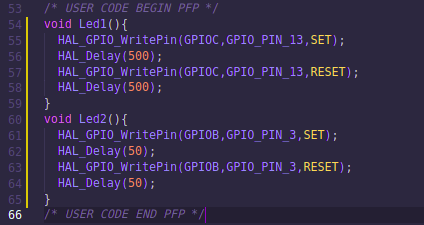
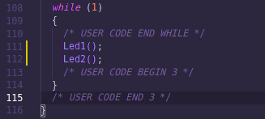
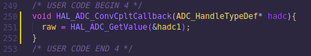

# ADC Interrupt

## 1. Selayang Pandang
Di repo ini, dilakukan pembacaan nilai ADC pake **metode _Interrupt_**. Nah ngapain tuh? Jadi, kita bisa baca ADC ini tanpa ganggu proses yang lain di CPU atau ibarat kata kek _paralel_ gitu si cuma ya ga _paralel-paralel_ amat.

### Maksutnya gimana cok!? <br>
Ya yang namanya _interrupt_ atau interupsi kalo indo, berati kita kasih pemicu atau _trigger_ buat interupsi atau menghentikan sesuatu. <br>
```
"Ih kamu mah ngegame mulu, fokus ngedate dulu napa"
```
Kurleb kek lu dimarahin doi lu gegara sibuk main game mulu pas ngedate ~~(sok iye cok punya doi ngehalu amat)~~

## 2. Penjabaran Code

### Deklarasi variabel


    raw untuk menampung nilai konversi ADC Polling

### Deklarasi fungsi
Dibuatlah fungsi _**Led Blink**_ biar keliatan gitu kalo paralel. Nah fungsi ini bertujuan biar ada kerjaan gitu di CPU nya, biar bisa kita buktiin ini proses Led Blink ga keganggu pas perintah baca ADC di trigger <br>



    GPIO WritePin biasa untuk trigger si LED



    Dijalanin di while(1) atau loop utama dari si CPU ini

### Pembacaan ADC
Nah disini kalo pake metode **_interrupt_** kudu dibikin manual nih fungsi _**Callback**_ nya. Sebenernya ada cara lain si, tar deh diupdate kalo udah paham betul gua



    1. Assign variabel raw sebagai wadah nilai ADC
    2. HAL_ADC_GetValue(&hadc1) untuk membaca nilai ADC