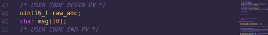
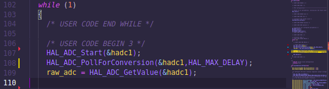

# ADC Polling

## 1. Selayang Pandang
Di repo ini, dilakukan pembacaan nilai ADC pake **metode _Polling_** atau bahasa gampangnya baca ADC tapi lewat CPU dulu akhirnya bikin *blocking* jadi si MCU gabisa lakuin aktifitas lain atau biasa disebut secara *serial*

 
Sumber gambar: Digikey

### Ngapa si ko bisa _blocking_?  
Bayangin ini semua diproses CPU dan dilakuin secara _serial_ dijalanin secara berurutan setiap proses yang terjadi. Jadi, jika ada pembacaan dengan menggunakan **metode _Polling_** maka dilakukan berurutan sampai beres dulu itu konversinya baru dilanjut proses lain itu MCU

## 2. Penjabaran Code

### Deklarasi variabel

    1. raw_adc untuk menampung nilai konversi ADC Polling
    2. msg untuk menampung string dari raw_adc yang bertipe uint16_t

### Pembacaan ADC

    1. HAL_ADC_Start(&hadc1) untuk mendeklarasikan pinout adc yang akan dibaca/dikonversi
    2. HAL_ADC_PollConversion(&hadc1, HAL_MAX_DELAY) fungsi untuk melakukan pembacaan ADC menggunakan Polling
    3. Assign raw_adc sebagai wadah dari bacaan/konversi nilai ADC menggunakan fungsi HAL_ADC_GetValue(&hadc1)