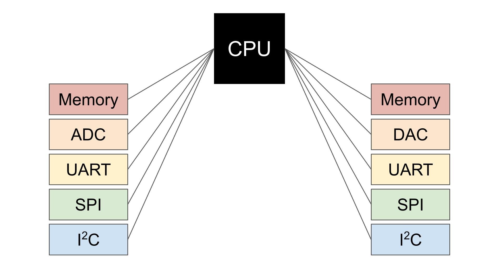

# ADC Polling - BluePill F103C8

## 1. Selayang Pandang
Pada repo ini, ditulis hasil belajar mengenai pembacaan ADC pada STM32 khususnya dalam metode _**Polling**_. 
### Nah apatuh _**Polling**_ ?
Jadi, metode _polling_ itu ibarat kek serial. CPU pada MCU difokuskan untuk melakukan suatu proses dalam hal ini baca ADC, sehingga apabila di CPU ada proses lain maka dijeda dulu sampe proses baca ADC ini kelar baru lanjut ke proses lain.   _Just like serial did~_

 
Sumber gambar: Digikey

Nah dari contoh skema diatas, keliatan kan si CPU banyak bet proses yang dijalanin disana. Jadi kalo pake metode _**Polling**_ ini pastinya bikin _**blocking**_ atau ngehambat proses lain yang ada di CPU. gituu~~

## 2. Penjabaran Code